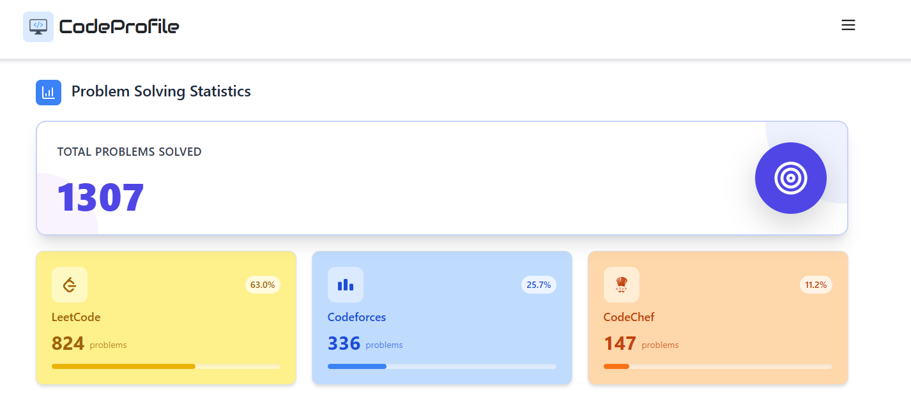
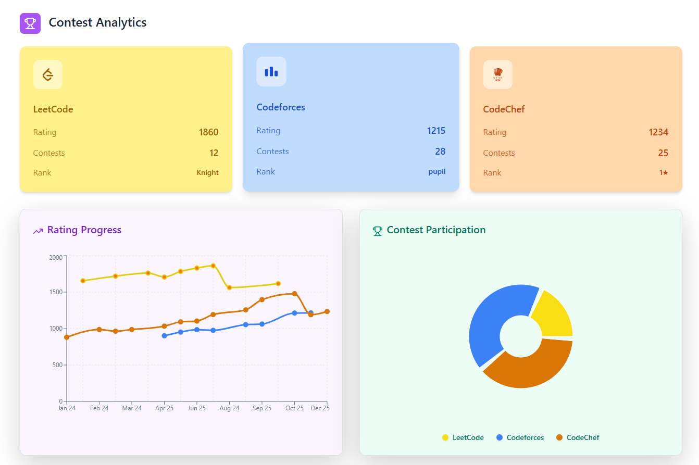
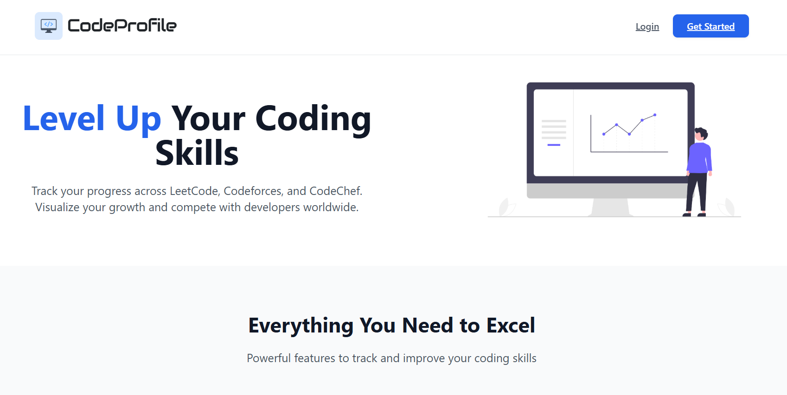
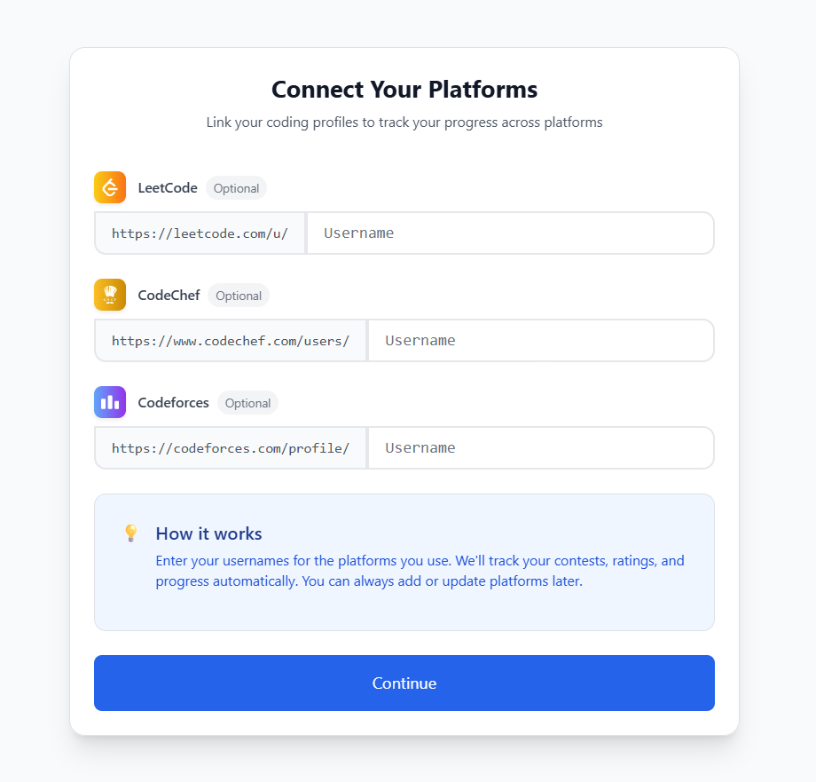

# 🚀 CodeProfile – Competitive Programming Dashboard

CodeProfile is a **full-stack competitive programming dashboard** that aggregates and visualizes user data from **LeetCode, Codeforces, and CodeChef** in one place.  
It helps programmers track their **problem-solving progress, contest participation, ratings, and growth over time** through a clean and intuitive UI.

---

## ✨ Key Features

- 🔗 **Multi-Platform Integration**
  - Connect LeetCode, Codeforces, and CodeChef profiles using usernames
  - Optional platform linking — connect only what you use

- 📊 **Problem Solving Statistics**
  - Total problems solved across platforms
  - Platform-wise distribution with progress indicators

- 🏆 **Contest Analytics**
  - Current rating, rank, and contest count per platform
  - Unified view of competitive performance

- 📈 **Rating Progress Tracking**
  - Visual line chart showing rating changes over time
  - Compare growth across multiple platforms

- 🥧 **Contest Participation Insights**
  - Pie chart showing participation distribution
  - Easy comparison between platforms

- ⚡ **Modern UI & UX**
  - Clean dashboard layout
  - Responsive design
  - Smooth data visualization

---

## 📸 Screenshots
<p align="center">
  
</p>
<p align="center">
  
</p>
<p align="center">
  
</p>
<p align="center">
  
</p>


---

## 🏗️ Tech Stack

### Frontend
- React (Vite)
- JavaScript
- Chart.js / Recharts (for data visualization)
- Modern CSS (cards, gradients, responsive layout)

### Backend
- Node.js
- Express.js
- MongoDB + Mongoose
- Web scraping & API-based data fetching

---

## 📁 Repository Structure


## Repository structure

- `backend/` - Express API, MongoDB models, scraping controllers.
  - `server.js` - app entrypoint
  - `routes/` - API routes (auth, leetcode, codeforces, codechef, platform)
  - `controller/` - controllers that fetch and format platform data and auth
  - `model/` - Mongoose user model
  - `webScraping/` - scrapers for CodeChef and LeetCode
- `frontend/` - React + Vite single page app
  - `src/` - React components and styles
  - `public/` - static assets

---

## Quickstart (Windows)

Requirements
- Node.js v18+ (tested with Node 20)
- npm (or yarn)
- MongoDB (local or hosted like Atlas)

1) Clone the repository

2) Backend setup

- Change to the backend folder and install dependencies:

```powershell
cd backend
npm install
```

- Create a `.env` file in `backend/` (example below) and set these variables:

```
PORT=3000
MONGO_URI=<your-mongodb-connection-string>
ACCESS_TOKEN_SECRET=<random-secret-for-access-token>
REFRESH_TOKEN_SECRET=<random-secret-for-refresh-token>
```
